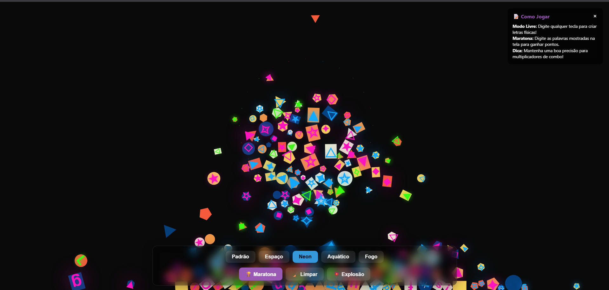
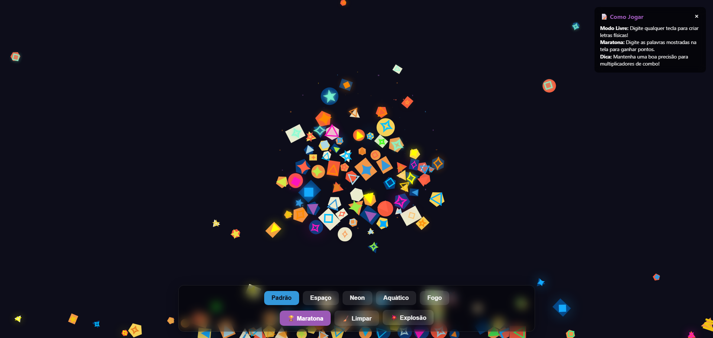

# Living Lyrics 🎮✨

**Living Lyrics** is an interactive typing and physics-based word game built with **HTML, CSS, and JavaScript** using the [Matter.js](https://brm.io/matter-js/) physics engine.  
Type letters to bring them to life with dynamic physics, glowing effects, and themed animations — or challenge yourself in **Marathon Mode** to test your speed, accuracy, and combos.

---

## 🚀 Features

- 📝 **Two Modes**
  - **Free Mode** – Type anything and watch letters fall, bounce, and interact with physics.
  - **Marathon Mode** – Type words shown on screen, earn points, and track your performance.

- 🎨 **Themes**
  - Default, Space, Neon, Underwater, Fire  
  - Each theme comes with unique effects (e.g., glowing, floating bubbles, sparks, flames).

- 📊 **Stats Panel**
  - Score, word count, accuracy, combo multiplier, and WPM (words per minute).

- 💥 **Special Effects**
  - Explosions, particle effects, glowing letters, and combo bursts.

- 🌍 **Multilingual Support**
  - Word challenges in **Portuguese** and **English** (with fallback if external API is unavailable).

---

## 🕹️ How to Play

- **Free Mode**  
  Just start typing! Each letter appears as a physical object with effects.  
  - Use **🧹 Clear** to reset the screen.  
  - Use **💥 Explosion** to trigger a particle blast.  

- **Marathon Mode**  
  Click **🏆 Marathon** and type the words displayed on the screen.  
  - Keep accuracy high to maintain your combo multiplier.  
  - Score points faster by typing correctly and chaining combos.  
  - The game ends when you stop the challenge, and your results are displayed.

---

## 📸 Game photos

---


---

## 📦 Installation

1. Clone this repository:
   ```bash
   git clone https://github.com/your-username/living-lyrics.git
   cd living-lyrics
   ```

2. Open the `index.html` file in your browser.  
   *(No server required — works offline!)*

---

## 🛠️ Technologies Used

- **HTML5 / CSS3 / JavaScript**
- **[Matter.js](https://brm.io/matter-js/)** – 2D physics engine
- DOM APIs for animations and interactivity

---

## 🎯 Roadmap / Future Ideas

- ✅ Difficulty levels for Marathon Mode  
- ✅ More particle and glow effects  
- 🔲 Add music/sound feedback  
- 🔲 Leaderboard system  
- 🔲 Mobile optimization  

---

## 📄 License

This project is licensed under the **MIT License** – feel free to use, modify, and share!  
